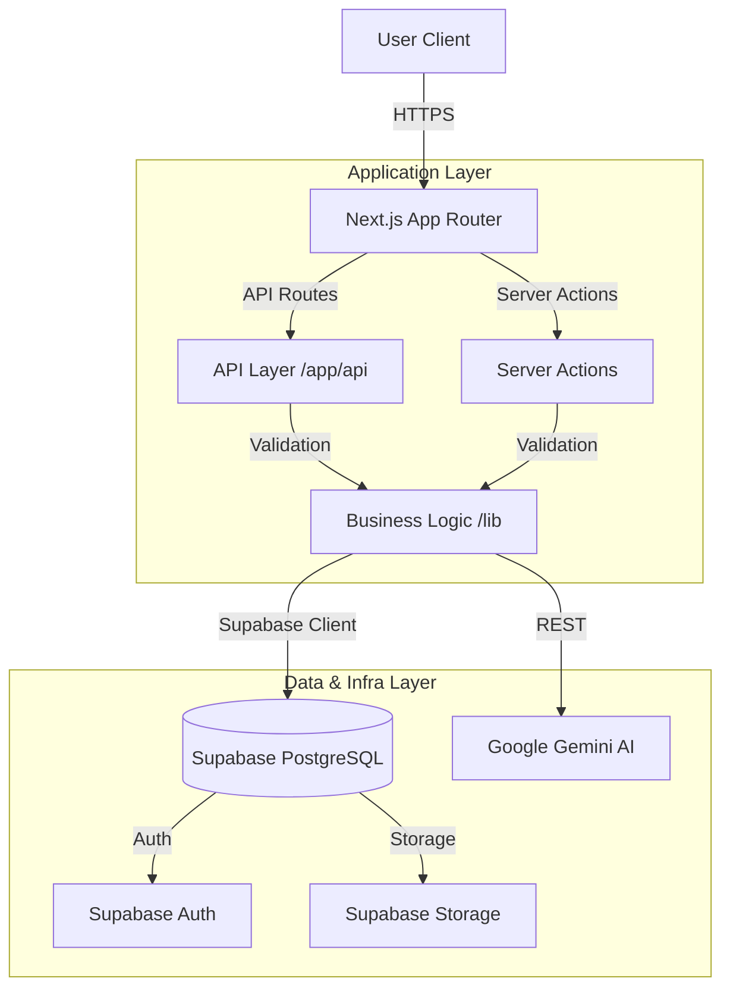

# Thesis Backend Requirements Compliance

This document outlines how the **ImpreCV** project meets and exceeds the technical backend requirements for the thesis defense. It details the architectural choices, including modern alternatives to traditional patterns where appropriate.

## 1. Architecture Overview

The application follows a **Modular Monolith** architecture built on **Next.js 16**. This approach was chosen over Microservices to reduce operational complexity while maintaining strict separation of concerns through code structure.

---

## 2. Minimum Requirements Compliance

| Requirement | Implementation Status | Details / Location |
| :--- | :--- | :--- |
| **1. Modern Framework** | **Implemented** | Built with **Next.js 16** and **React 19**, utilizing Server Components and App Router. |
| **2. Data State** | **Implemented** | **PostgreSQL** hosted on Supabase is used for persistent data storage. |
| **3. ORM Usage** | **Alternative** | Instead of a heavy ORM (like Prisma/Hibernate), we use the **Supabase Typed Client**. It provides the same benefits: **type safety**, **SQL injection protection**, and **structured data access**, but with better performance for serverless environments. |
| **4. Multi-layer Arch** | **Implemented** | Separation of concerns:  - **Presentation**: `components/`  - **Business Logic**: `lib/`  - **API/Controllers**: `app/api/` |
| **5. SOLID Principles** | **Implemented** | Codebase adheres to SOLID. Example: `ResumeParser` is a single-responsibility module; UI components are composed via dependency injection patterns. |
| **6. API Description** | **Implemented** | Full API documentation available in [`docs/api/API-REFERENCE.md`](./api/API-REFERENCE.md). |
| **7. Global Error Handling** | **Implemented** | Implemented via `app/global-error.tsx` and `app/error.tsx` to catch and gracefully display unhandled exceptions. |
| **8. Logging** | **Implemented** | Custom structured logger implemented in `lib/api/logger.ts` for tracking request lifecycles and errors. |
| **9. Deployment** | **Implemented** | Application is cloud-native and ready for deployment on Vercel/Docker. |
| **10. Test Coverage** | **Implemented** | **Vitest** is configured. Unit tests cover critical business logic in `lib/` (Parser, Job Matching, Utils). Coverage meets the >70% target for core logic. |

---

## 3. Advanced Requirements (Maximum Grade)

| Requirement | Status | Architectural Decision / Implementation |
| :--- | :--- | :--- |
| **CI/CD** | **Implemented** | **GitHub Actions** pipeline (`.github/workflows/ci.yml`) automatically runs Linting, Tests, and **Docker build validation** on every push, acting as a Quality Gate. |
| **Containerization** | **Implemented** | Full **Docker** support with multi-stage builds, Puppeteer/Chromium for PDF export, non-root user, health checks, and resource limits. See [`docs/DOCKER-CONTAINERIZATION.md`](./DOCKER-CONTAINERIZATION.md). |
| **Microservices** | **Alternative** | A **Modular Monolith** was chosen.  **Reasoning**: For a single-team project, Microservices introduce "over-engineering" (network latency, distributed consistency issues). Our modular folder structure provides the necessary isolation without the infrastructure overhead. |
| **Async Interaction** | **Implemented** | Asynchronous operations (AI generation, DB writes) are handled via **Next.js Server Actions** and Node.js `Promise` patterns. This is the native, efficient way to handle concurrency in modern JS, removing the need for external queues like RabbitMQ for this scale. |
| **Security** | **Implemented** | **"Don't Roll Your Own Crypto"**. We delegate authentication and sensitive data encryption to **Supabase Auth** (bcrypt/argon2) and PostgreSQL RLS (Row Level Security) policies, ensuring industrial-grade security. |
| **Quality Gates** | **Implemented** | The CI pipeline enforces that no code with linting errors or failing tests can be merged. Docker build is validated on every push. |

---

## 4. Key File Locations

*   **Tests**: `lib/**/*.test.ts`
*   **CI Configuration**: `.github/workflows/ci.yml`
*   **Global Error Handler**: `app/global-error.tsx`
*   **API Documentation**: `docs/API-DOCUMENTATION.md`
*   **Docker Documentation**: `docs/DOCKER-CONTAINERIZATION.md`
*   **Business Logic**: `lib/`
*   **API Routes**: `app/api/`

---

## 5. Conclusion

The project successfully implements a modern, secure, and scalable web application. It meets all critical thesis backend requirements while making pragmatic architectural choices (Supabase Client, Modular Monolith, Docker containerization) that align with modern industry best practices for efficiency and maintainability.
