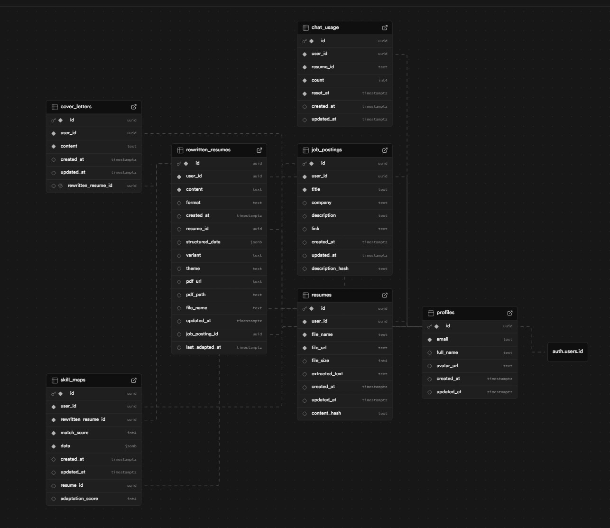

# CVify Database Architecture

## Overview

CVify uses **PostgreSQL** (via Supabase) as its primary database. The schema is designed for an OLTP (Online Transaction Processing) workload — handling real-time user operations like resume uploads, job matching, and document generation.

This document describes the database design decisions, structure, and rationale behind the implementation.

## Technology Choice: Why PostgreSQL?

| Requirement | PostgreSQL Capability |
|-------------|----------------------|
| Structured user data | Strong relational model with foreign keys |
| JSON storage for AI outputs | Native JSONB with indexing support |
| Row-level security | Built-in RLS policies |
| Full-text search (future) | tsvector/tsquery support |
| Transactions | ACID compliance |
| Supabase integration | First-class support, auth integration |

### Technology Decisions

| Technology | Decision | Rationale |
|------------|----------|-----------|
| **OLAP / ClickHouse** | Not applicable | CVify processes individual user requests in real-time (resume upload, job matching). The application does not perform analytical queries over large historical datasets. PostgreSQL handles our read/write patterns efficiently for this use case. |
| **Raw / Staging / Data Mart** | Not applicable | Data flows directly from user input to storage. The application has no batch processing, scheduled ETL jobs, or data transformation pipelines that would require intermediate staging tables. |
| **SCD (Slowly Changing Dimensions)** | Not applicable | Users edit their current resume version. The application does not require historical tracking of how resumes changed over time. The `updated_at` timestamp provides sufficient audit information for current needs. |
| **NoSQL (MongoDB, Redis)** | PostgreSQL JSONB used instead | Semi-structured data (AI-generated resume sections) is stored in JSONB columns. This provides document-like flexibility while maintaining relational integrity through foreign keys. See "Why JSONB?" section for detailed examples. |

## Design Decisions

This section documents design choices and their rationale.

### Access Control: Supabase Built-in Roles + RLS

Supabase provides built-in PostgreSQL roles that integrate with its authentication system:

| Role | Purpose | Usage in CVify |
|------|---------|----------------|
| `anon` | Unauthenticated requests | Public pages (landing, login) |
| `authenticated` | Logged-in users | All user operations |
| `service_role` | Server-side operations | API routes that bypass RLS |

**How access control works in practice:**

Instead of creating custom roles like `app_read` or `app_write`, CVify uses Row-Level Security (RLS) policies. When a user queries the `resumes` table, the policy automatically filters results:

```sql
-- This policy is applied to every SELECT on the resumes table
CREATE POLICY "Users can view their own resumes"
  ON public.resumes FOR SELECT
  USING (auth.uid() = user_id);
```

When user `abc-123` runs `SELECT * FROM resumes`, PostgreSQL internally transforms it to:
```sql
SELECT * FROM resumes WHERE user_id = 'abc-123'
```

This approach provides row-level isolation without requiring separate database roles per permission level.

### Personal Data in JSONB Columns

The `structured_data` column in `rewritten_resumes` contains personal information (name, email, phone) as part of the resume structure. This data is stored unmasked because:

1. **Data ownership**: Users create and own their resume data. This is not third-party PII that requires anonymization.

2. **Access control**: RLS policies ensure users can only access their own records. Other users cannot query this data.

3. **Application requirement**: The frontend renders resume templates directly from this JSON structure. The data must be complete for PDF generation and preview.

**Masked view for reporting**: For scenarios requiring anonymized data (e.g., aggregate statistics), the `profiles_masked` view demonstrates the masking technique:

```sql
-- Example: how profiles_masked works
SELECT 
  id,
  CONCAT(LEFT(email, 2), '***@', SUBSTRING(email FROM POSITION('@' IN email) + 1)) as email_masked
FROM profiles;
-- Result: "jo***@example.com"
```

### Multi-Step Operations: Compensating Transactions

When a user uploads a resume, two operations must succeed together:
1. Upload file to Supabase Storage
2. Insert metadata record into `resumes` table

The application implements a compensating transaction pattern in `lib/supabase/transaction.ts`:

```typescript
const txResult = await uploadFileWithRecord(supabase, {
  bucket: "resumes",
  filePath,
  fileBuffer,
  insertRecord: async () => supabase.from("resumes").insert({...})
});
```

**How it works:**
1. Upload file to storage
2. Insert database record
3. If step 2 fails, automatically delete the uploaded file from step 1

This pattern ensures data consistency. The rollback logic is explicit and testable, which simplifies debugging. For operations requiring stronger guarantees, Supabase Edge Functions with the `postgres` driver could be used for true atomic transactions.

### Business Logic Location: API Routes

CVify implements business logic in Next.js API routes rather than PostgreSQL stored procedures:

**Example: Resume adaptation flow** (`app/api/adapt-resume/route.ts`)
1. Validate user authentication
2. Parse uploaded resume
3. Call Gemini AI API for adaptation
4. Save result to database

This logic requires:
- TypeScript type checking for request/response handling
- External API calls (Gemini AI) — not possible from PostgreSQL
- Integration with Next.js authentication middleware

**Database functions that exist:**
- `update_updated_at_column()` — trigger function that automatically updates timestamps
- `handle_new_user()` — trigger function that creates a profile when a user registers

These are appropriate for database-level automation that does not require external services.

### Table Partitioning Approach

Table partitioning is not implemented in the current version. The expected data volume is under 100K rows per table (personal productivity tool). All queries filter by `user_id`, which is indexed. If the application scales significantly, `rewritten_resumes` could be partitioned by `created_at` using range partitioning.

### Features Managed by Supabase

Supabase handles several infrastructure concerns automatically:

| Feature | How Supabase Handles It |
|---------|------------------------|
| **Connection pooling** | PgBouncer is included and configured automatically. The application connects through the pooler endpoint. |
| **Backups** | Daily automated backups with point-in-time recovery (on Pro plan). |
| **SSL/TLS** | All database connections require SSL. Certificates are managed by Supabase. |
| **Authentication tables** | `auth.users`, `auth.sessions`, `auth.refresh_tokens` are created and managed by Supabase Auth. |
| **Storage tables** | `storage.buckets`, `storage.objects` are managed by Supabase Storage. RLS policies control access. |

## Schema Design

### Normalization Level

The schema follows **3NF (Third Normal Form)**:

1. **1NF**: All columns contain atomic values (no arrays in regular columns, JSONB is intentional for flexible AI output)
2. **2NF**: All non-key columns depend on the entire primary key (single-column PKs)
3. **3NF**: No transitive dependencies (e.g., `job_title` is not duplicated in `rewritten_resumes` — it's accessed via FK join)

**Intentional denormalization:**
- `content` in `rewritten_resumes` duplicates serialized `structured_data` for quick text search
- `match_score` in `skill_maps` duplicates value from `data` JSONB for indexed queries

### Entity-Relationship Overview


### Tables

#### `profiles`
Extends Supabase `auth.users` with application-specific data.

| Column | Type | Description |
|--------|------|-------------|
| id | UUID | Primary key, references auth.users |
| email | TEXT | User email (validated by CHECK constraint) |
| full_name | TEXT | Display name |
| avatar_url | TEXT | Profile picture URL |
| created_at | TIMESTAMPTZ | Registration timestamp |
| updated_at | TIMESTAMPTZ | Last modification (auto-updated by trigger) |

#### `resumes`
Original uploaded resume files.

| Column | Type | Description |
|--------|------|-------------|
| id | UUID | Primary key |
| user_id | UUID | Owner reference |
| file_name | TEXT | Original filename (must be non-empty) |
| file_url | TEXT | Supabase Storage URL |
| file_size | INTEGER | File size in bytes (must be positive) |
| extracted_text | TEXT | Parsed text content |
| content_hash | TEXT | MD5 hash for duplicate detection |

#### `job_postings`
Job vacancy information for matching.

| Column | Type | Description |
|--------|------|-------------|
| id | UUID | Primary key |
| user_id | UUID | Owner reference |
| title | TEXT | Job title (must be non-empty) |
| company | TEXT | Company name (nullable) |
| description | TEXT | Full job description |
| description_hash | TEXT | Hash for deduplication |
| link | TEXT | Source URL (validated format) |

#### `rewritten_resumes`
AI-adapted resumes linked to specific job postings.

| Column | Type | Description |
|--------|------|-------------|
| id | UUID | Primary key |
| user_id | UUID | Owner reference |
| resume_id | UUID | Original resume (nullable, SET NULL on delete) |
| job_posting_id | UUID | Target job (nullable, SET NULL on delete) |
| content | TEXT | Serialized resume content |
| structured_data | JSONB | Parsed resume structure for rendering |
| format | TEXT | Content format: 'json', 'text', 'markdown' |
| variant | TEXT | Template variant: 'tailored', 'original', 'optimized' |
| theme | TEXT | Visual theme: 'light', 'dark', 'modern', 'classic', 'minimal' |
| pdf_url | TEXT | Generated PDF download URL |
| last_adapted_at | TIMESTAMPTZ | Last AI processing timestamp |

#### `skill_maps`
AI-generated skill analysis results.

| Column | Type | Description |
|--------|------|-------------|
| id | UUID | Primary key |
| user_id | UUID | Owner reference |
| rewritten_resume_id | UUID | Associated adapted resume |
| match_score | INTEGER | Job match percentage (0-100) |
| adaptation_score | INTEGER | Resume improvement score (0-100, nullable) |
| data | JSONB | Full analysis: matched skills, gaps, recommendations |

#### `cover_letters`
Generated cover letters (one per adapted resume).

| Column | Type | Description |
|--------|------|-------------|
| id | UUID | Primary key |
| user_id | UUID | Owner reference |
| rewritten_resume_id | UUID | Associated resume (UNIQUE constraint) |
| content | TEXT | Letter text |

#### `chat_usage`
Rate limiting for AI chat modifications. Tracks daily usage per user/resume.

| Column | Type | Description |
|--------|------|-------------|
| id | UUID | Primary key |
| user_id | UUID | Owner reference |
| resume_id | TEXT | Either "global" or specific rewritten_resume UUID |
| count | INTEGER | Number of modifications made (0+) |
| reset_at | TIMESTAMPTZ | When the counter resets (24h after first use) |
| created_at | TIMESTAMPTZ | Record creation timestamp |
| updated_at | TIMESTAMPTZ | Last modification |

**Unique constraint:** `(user_id, resume_id)` — one counter per user per context.

**Rate limit:** 50 modifications per 24 hours per context.

## Why JSONB?

The `structured_data` and `data` columns use JSONB for several reasons:

### 1. Variable Structure Handling

AI generates resumes with different numbers of sections. One resume might have 2 work experiences, another might have 5. JSONB accommodates this without schema changes:

```json
{
  "personalInfo": {
    "name": "John Doe",
    "email": "john@example.com",
    "title": "Software Engineer"
  },
  "sections": [
    {
      "type": "experience",
      "title": "Work Experience",
      "content": [
        {
          "title": "Senior Developer",
          "subtitle": "Tech Corp",
          "date": "2020 - Present",
          "bullets": ["Led team of 5", "Improved performance by 40%"]
        }
      ]
    },
    {
      "type": "skills",
      "title": "Technical Skills",
      "content": "React, TypeScript, Node.js, PostgreSQL"
    }
  ]
}
```

### 2. Direct Frontend Consumption

The React resume editor in `components/resume-templates/resume-editor.tsx` reads this structure directly to render templates. The section order in JSON determines display order. Users can reorder sections by updating the array, and the change persists without additional database columns.

### 3. Template Flexibility

Different resume templates (modern, classic, minimal) use the same JSON structure but render it differently. The `type` field in each section tells the template how to display that content. This is implemented in `components/resume-templates/` renderers.

### 4. PostgreSQL Indexing Support

PostgreSQL can create GIN indexes on JSONB for efficient querying if needed:

```sql
CREATE INDEX idx_structured_data_skills ON rewritten_resumes 
  USING GIN ((structured_data->'sections'));
```

## Constraints and Validation

### CHECK Constraints

| Table | Constraint | Purpose |
|-------|------------|---------|
| profiles | `check_email_format` | Validates email format using regex |
| resumes | `check_file_name_not_empty` | Prevents empty filenames |
| resumes | `check_file_size_positive` | Ensures valid file sizes |
| job_postings | `check_title_not_empty` | Requires job title |
| job_postings | `check_link_format` | Validates URL format (http/https) |
| rewritten_resumes | `check_format_valid` | Enum: json, text, markdown |
| rewritten_resumes | `check_variant_valid` | Enum: tailored, original, optimized |
| rewritten_resumes | `check_theme_valid` | Enum: light, dark, modern, classic, minimal |
| skill_maps | `check_match_score` | Range: 0-100 |
| skill_maps | `check_adaptation_score` | Range: 0-100 (nullable) |
| chat_usage | `check_count_non_negative` | count >= 0 |

### Foreign Key Behavior

| Relationship | ON DELETE |
|--------------|-----------|
| profiles → auth.users | CASCADE (remove profile when user deleted) |
| resumes → profiles | CASCADE |
| job_postings → profiles | CASCADE |
| rewritten_resumes → profiles | CASCADE |
| rewritten_resumes → resumes | SET NULL (preserve adapted resume if original deleted) |
| rewritten_resumes → job_postings | SET NULL (preserve resume if job deleted) |
| cover_letters → rewritten_resumes | CASCADE (delete letter with resume) |
| skill_maps → rewritten_resumes | CASCADE |
| chat_usage → profiles | CASCADE |

## Indexes

### Performance Indexes

```sql
-- User-based queries (most common pattern)
idx_resumes_user_id
idx_job_postings_user_id
idx_rewritten_resumes_user_created_at
idx_cover_letters_user_created_at
idx_skill_maps_user_id
idx_chat_usage_user_resume

-- Duplicate detection
idx_resumes_content_hash
idx_job_postings_description_hash
```

### Unique Indexes (Business Rules)

```sql
-- One resume per filename per user
idx_resumes_user_id_file_name_unique

-- One job posting per link per user
idx_job_postings_user_link_unique

-- One adapted resume per (original, job) combination
idx_rewritten_resumes_resume_job_unique

-- One skill map per adapted resume per user
idx_skill_maps_user_resume_unique
```

## Row-Level Security (RLS)

All tables have RLS enabled with ownership-based policies:

```sql
-- Example policy pattern (applied to all tables)
CREATE POLICY "Users can view their own data"
  ON public.table_name FOR SELECT
  USING (auth.uid() = user_id);

CREATE POLICY "Users can modify their own data"
  ON public.table_name FOR UPDATE
  USING (auth.uid() = user_id)
  WITH CHECK (auth.uid() = user_id);
```

This ensures:
- Users can only access their own records
- No admin role needed for basic operations
- Security enforced at database level, not just application

**Tables with RLS:** `profiles`, `resumes`, `job_postings`, `rewritten_resumes`, `cover_letters`, `skill_maps`, `chat_usage` (7 tables total).

## Views

Views are created with `security_invoker = true` to respect RLS policies:

| View | Purpose |
|------|---------|
| `resume_job_analysis` | Dashboard data: combines resumes, jobs, skill maps, cover letters |
| `user_statistics` | Aggregate stats: total resumes, average match score, etc. |
| `profiles_masked` | GDPR-compliant view with masked PII |
| `skill_analysis_details` | Skill maps with job context |
| `job_match_summary` | Quick overview of job applications |
| `recent_activity` | Activity feed combining all user actions |

## Triggers

### Automatic `updated_at`

All tables have triggers that update the `updated_at` column on modification:

```sql
CREATE TRIGGER update_<table>_updated_at
  BEFORE UPDATE ON public.<table>
  FOR EACH ROW EXECUTE FUNCTION public.update_updated_at_column();
```

### Profile Creation

When a user registers via Supabase Auth, a profile is automatically created:

```sql
CREATE TRIGGER on_auth_user_created
  AFTER INSERT ON auth.users
  FOR EACH ROW EXECUTE FUNCTION public.handle_new_user();
```

## Transaction Handling

Multi-step operations use a compensating transaction pattern implemented in `lib/supabase/transaction.ts`:

```typescript
// Example from app/api/resumes/upload/route.ts
const txResult = await uploadFileWithRecord(supabase, {
  bucket: "resumes",
  filePath,
  fileBuffer: buffer,
  insertRecord: async () => {
    return await supabase.from("resumes").insert({
      user_id: user.id,
      file_name: fileName,
      file_url: fileUrl,
      file_size: fileSize,
      extracted_text: extractedText,
      content_hash: contentHash
    }).select()
  },
});

if (!txResult.success) {
  // File upload was automatically rolled back if DB insert failed
  return NextResponse.json({ error: txResult.error }, { status: 500 });
}
```

The `deleteRecordWithFile` utility provides the inverse operation for deletions:

```typescript
// Example from app/api/resumes/[id]/route.ts
const txResult = await deleteRecordWithFile(supabase, {
  bucket: "resumes",
  filePath: resume.file_url,
  deleteRecord: async () => supabase.from("resumes").delete().eq("id", id)
});
```

## Storage

Resume files are stored in Supabase Storage with RLS policies:

- Bucket: `resumes` (private)
- Path pattern: `{user_id}/{timestamp}-{filename}`
- Policies: Users can only access their own folder

## Migrations

Migrations are managed via Supabase CLI format in `supabase/migrations/`:

| File | Description |
|------|-------------|
| `20251202000001_create_tables.sql` | Table definitions with constraints |
| `20251202000002_create_indexes.sql` | Performance and unique indexes |
| `20251202000003_setup_rls.sql` | RLS policies for all tables |
| `20251202000004_create_functions_triggers.sql` | Functions and triggers |
| `20251202000005_create_views.sql` | Database views |
| `20251202000006_create_storage.sql` | Storage buckets and policies |
| `20251202000007_seed_test_data.sql` | Test data for development |

Test data is maintained in a single location (`20251202000007_seed_test_data.sql`) to ensure consistency and prevent duplicate entries.

To apply migrations:
```bash
supabase db push
# or
supabase migration up
```

## Future Considerations

1. **Full-text search**: Add `tsvector` columns for resume content search
2. **Audit logging**: Implement if compliance requires tracking changes
3. **Partitioning**: Consider if data volume grows significantly (>1M rows)
4. **Read replicas**: For scaling read-heavy operations

## Summary

The database architecture is designed for a real-time user-facing application:

| Aspect | Implementation |
|--------|----------------|
| **Normalization** | Third Normal Form (3NF) with intentional denormalization for performance |
| **Access Control** | Row-Level Security (RLS) on all 7 tables |
| **Data Validation** | 11+ CHECK constraints at database level |
| **Referential Integrity** | Foreign keys with appropriate CASCADE/SET NULL behavior |
| **Semi-structured Data** | JSONB for AI-generated content with direct frontend consumption |
| **Reporting Views** | 6 views with `security_invoker = true` for RLS compliance |
| **Automation** | Triggers for `updated_at` timestamps and profile creation |
| **Transaction Handling** | Compensating transaction pattern for multi-step operations |
| **Performance** | Indexes optimized for user-based queries (primary access pattern) |

This design supports the current feature set while providing a foundation for future enhancements.
