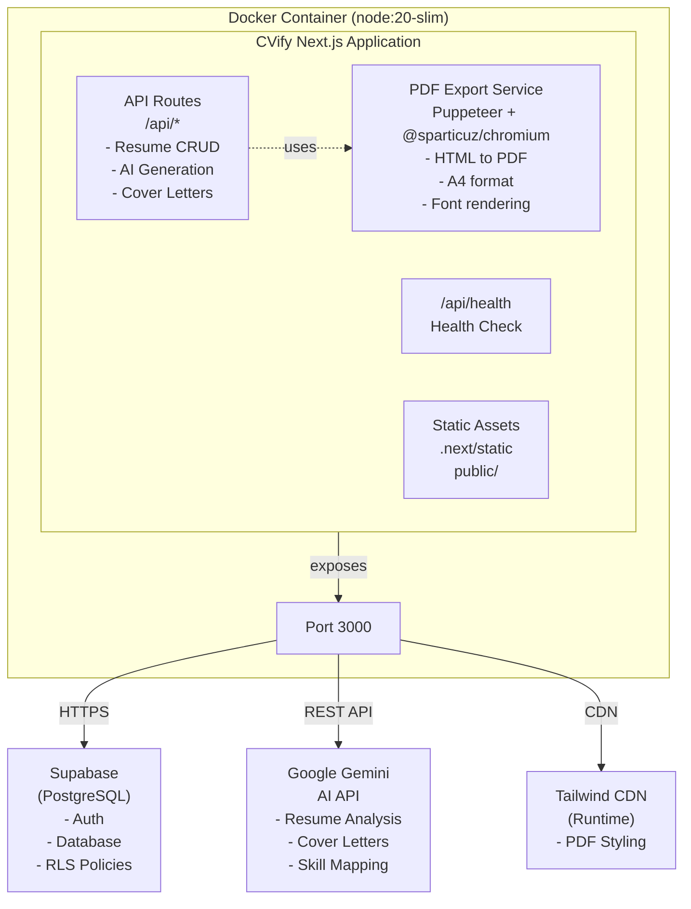
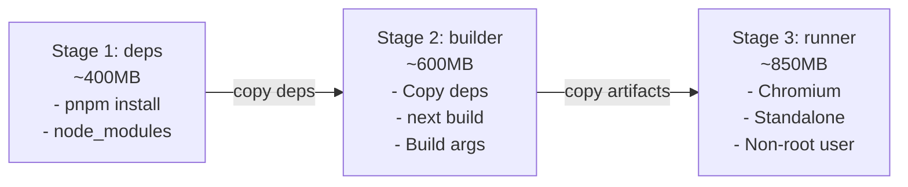

# CVify Docker Containerization Documentation

This document provides comprehensive documentation for the Docker containerization of the CVify application, meeting all thesis requirements for reproducible deployment.

---

## 1. Architecture Overview

The CVify application is containerized as a single **Next.js application** with integrated Puppeteer for PDF export functionality. External services (Supabase PostgreSQL, Google Gemini AI) are consumed as managed cloud services. **Deployment target: Railway** (container-based PaaS).



---

## 2. Docker Image Specification

### 2.1 Image Details

| Property | Value |
|----------|-------|
| **Base Image** | `node:20-slim` (Debian Bookworm) |
| **Final Image Size** | ~850MB - 1GB |
| **Build Strategy** | Multi-stage build (3 stages) |
| **User** | `nextjs` (UID 1001, non-root) |
| **Exposed Port** | 3000 |

### 2.2 Why `node:20-slim`?

| Alternative | Decision | Reasoning |
|-------------|----------|-----------|
| `node:20-alpine` | Rejected | Chromium installation complex on Alpine (musl libc issues) |
| `node:20` | Rejected | Unnecessarily large (~1.1GB base) |
| `node:20-slim` | **Chosen** | Optimal balance: Debian-based for Chromium compatibility, minimal size |

### 2.3 Multi-Stage Build Architecture



### 2.4 Layer Optimization Strategy

```dockerfile
# Optimized layer order (least → most frequently changed)
1. Base image + system packages    (rarely changes)
2. pnpm installation               (rarely changes)
3. package.json, pnpm-lock.yaml    (weekly changes)
4. npm dependencies                (cached if lockfile unchanged)
5. Application source code         (frequent changes)
6. Build output                    (changes with source)
```

---

## 3. Container Specification

### 3.1 Container Details

| Property | Value |
|----------|-------|
| **Container Name** | `cvify-app` |
| **Internal Port** | 3000 |
| **External Port** | 3000 (configurable) |
| **Restart Policy** | `unless-stopped` |
| **Memory Limit** | 2GB |
| **CPU Limit** | 2 cores |
| **Memory Reservation** | 512MB |
| **CPU Reservation** | 0.5 cores |

### 3.2 Health Check Configuration

```yaml
healthcheck:
  test: ["CMD", "node", "-e", "require('http').get('http://localhost:3000/api/health', ...)"]
  interval: 30s      # Check every 30 seconds
  timeout: 10s       # Fail if no response in 10s
  retries: 3         # Mark unhealthy after 3 failures
  start_period: 40s  # Grace period for container startup
```

**Health Endpoint Response:**
```json
{
  "status": "healthy",
  "timestamp": "2025-12-11T20:45:00.000Z",
  "uptime": 3600.123
}
```

### 3.3 Security Configuration

| Setting | Value | Purpose |
|---------|-------|---------|
| `cap_drop: ALL` | Drop all capabilities | Principle of least privilege |
| `cap_add: SYS_ADMIN` | Add SYS_ADMIN | Required for Chromium sandbox |
| `security_opt: seccomp:unconfined` | Disable seccomp | Required for Chromium |
| `USER nextjs` | Non-root user | Security best practice |

---

## 4. Environment Variables

### 4.1 Build-Time Variables (ARG)

These must be provided during `docker build`:

| Variable | Required | Description |
|----------|----------|-------------|
| `NEXT_PUBLIC_SUPABASE_URL` | ✅ Yes | Supabase project URL |
| `NEXT_PUBLIC_SUPABASE_ANON_KEY` | ✅ Yes | Supabase anonymous key |

> ⚠️ **Important**: `NEXT_PUBLIC_*` variables are inlined into client JavaScript at build time. They cannot be set only at runtime.

### 4.2 Runtime Variables (ENV)

| Variable | Required | Default | Description |
|----------|----------|---------|-------------|
| `NODE_ENV` | No | `production` | Node environment |
| `GEMINI_API_KEY` | Yes | - | Google Gemini API key |
| `PUPPETEER_SKIP_CHROMIUM_DOWNLOAD` | No | `true` | Use bundled @sparticuz/chromium |
| `PORT` | No | `3000` | Application port (Railway sets this automatically) |
| `HOSTNAME` | No | `0.0.0.0` | Bind address |

### 4.3 Example .env File

```bash
# .env.example
# Supabase Configuration (required at build time)
NEXT_PUBLIC_SUPABASE_URL=https://your-project.supabase.co
NEXT_PUBLIC_SUPABASE_ANON_KEY=your-anon-key

# Google Gemini API (required at runtime)
GEMINI_API_KEY=your-gemini-api-key
```

---

## 5. Files Structure

```
cvify-app/
├── Dockerfile              # Multi-stage build configuration
├── .dockerignore           # Excludes unnecessary files from build
├── docker-compose.yml      # Local development/testing orchestration
├── .env.example            # Environment template
├── .env                    # Local environment (gitignored)
└── styles/                 # Copied to container for PDF export
```

### 5.1 .dockerignore Contents

```
node_modules/
.next/
.git/
*.md
docs/
*.test.ts
coverage/
.env
.env.*
!.env.example
```

---

## 6. Commands Reference

### 6.1 Build Commands

```bash
# Build with Docker Compose (recommended)
docker compose build

# Build with no cache (clean rebuild)
docker compose build --no-cache

# Build directly with Docker
docker build \
  --build-arg NEXT_PUBLIC_SUPABASE_URL=your-url \
  --build-arg NEXT_PUBLIC_SUPABASE_ANON_KEY=your-key \
  -t cvify-app .
```

### 6.2 Run Commands

```bash
# Start container (detached)
docker compose up -d

# Start with build
docker compose up -d --build

# Start with logs visible
docker compose up

# Stop container
docker compose down

# Stop and remove volumes
docker compose down -v
```

### 6.3 Debug Commands

```bash
# View logs
docker logs cvify-app
docker logs cvify-app --tail 100 -f

# Check container status
docker ps
docker compose ps

# Execute shell in container
docker exec -it cvify-app /bin/bash

# Check health status
curl http://localhost:3000/api/health

# Verify non-root user
docker exec cvify-app id
# Expected: uid=1001(nextjs) gid=1001(nodejs)

# Check Chromium availability
docker exec cvify-app which chromium
# Expected: /usr/bin/chromium

# Inspect container
docker inspect cvify-app
```

### 6.4 Cleanup Commands

```bash
# Remove stopped containers
docker container prune

# Remove unused images
docker image prune

# Remove all unused resources
docker system prune -a

# Remove specific image
docker rmi cvify-app-app
```

---

## 7. Performance Metrics

### 7.1 Build Metrics

| Metric | Value | Notes |
|--------|-------|-------|
| **Full Build Time** | ~3-5 min | First build with no cache |
| **Cached Build Time** | ~30-60 sec | When only source code changes |
| **Dependencies Cache** | ~25 sec | pnpm install (cached) |
| **Next.js Build** | ~30-35 sec | Application compilation |
| **Chromium Install** | ~2-3 min | apt-get packages |

### 7.2 Image Size Breakdown

| Stage/Component | Size | Percentage |
|-----------------|------|------------|
| Base node:20-slim | ~200MB | 24% |
| Chromium + deps | ~400MB | 47% |
| Next.js standalone | ~150MB | 18% |
| Static assets | ~50MB | 6% |
| Other (fonts, etc.) | ~50MB | 5% |
| **Total** | **~850MB** | 100% |

### 7.3 Runtime Metrics

| Metric | Value |
|--------|-------|
| **Cold Start** | ~250-500ms |
| **Memory (idle)** | ~150-200MB |
| **Memory (under load)** | ~400-800MB |
| **Memory (PDF export)** | ~800MB-1.2GB peak |
| **CPU (idle)** | <1% |
| **CPU (PDF export)** | 50-100% (brief) |

---

## 8. Minimum Requirements Compliance

| Requirement | Status | Implementation |
|-------------|--------|----------------|
| **Dockerfile per service** | Implemented | Single service, single Dockerfile |
| **Layer optimization** | Implemented | Multi-stage build, optimized order |
| **.dockerignore** | Implemented | Excludes node_modules, .next, .git, tests |
| **ENV variables** | Implemented | All config via environment |
| **Volumes for data** | Implemented | Stateless app, DB on Supabase |
| **Port configuration** | Implemented | EXPOSE 3000, configurable |
| **Image size <1GB** | Implemented | ~850MB (includes Chromium) |
| **Multi-stage build** | Implemented | 3 stages: deps, builder, runner |
| **No secrets in image** | Implemented | All via build args / runtime env |
| **Non-root user** | Implemented | USER nextjs (UID 1001) |
| **docker-compose.yml** | Implemented | Full orchestration config |
| **depends_on** | N/A | Single service |
| **.env.example** | Implemented | Template provided |

---

## 9. Advanced Features Compliance

| Requirement | Status | Implementation |
|-------------|--------|----------------|
| **Healthcheck** | Implemented | /api/health endpoint, 30s interval |
| **Resource limits** | Implemented | memory: 2G, cpus: 2 |
| **Restart policy** | Implemented | unless-stopped |
| **Graceful shutdown** | Implemented | Node.js handles SIGTERM |
| **Layer caching** | Implemented | Documented strategy |
| **Security caps** | Implemented | cap_drop: ALL, minimal cap_add |

---

## 10. Troubleshooting

### PDF Export Fails

```bash
# Check @sparticuz/chromium is bundled
docker exec cvify-app ls -la node_modules/@sparticuz/chromium

# Check required libraries are present
docker exec cvify-app ldd /app/node_modules/@sparticuz/chromium/bin/chromium 2>/dev/null || echo "Check chromium binary path"

# Verify container has necessary capabilities
docker inspect cvify-app | grep -A 10 CapAdd
```

### Container Won't Start

```bash
# Check logs
docker logs cvify-app

# Verify environment variables
docker exec cvify-app env | grep -E "(SUPABASE|GEMINI)"

# Check port availability
netstat -an | grep 3000
```

### Out of Memory

```bash
# Increase memory limit in docker-compose.yml
deploy:
  resources:
    limits:
      memory: 4G  # Increase from 2G
```

### Authentication Not Working

Build args not passed correctly. Ensure `.env` file exists and rebuild:

```bash
docker compose down
docker compose build --no-cache
docker compose up -d
```

---

## 11. Production Deployment

### 11.1 Building for Production

```bash
# Tag with version
docker build \
  --build-arg NEXT_PUBLIC_SUPABASE_URL=$SUPABASE_URL \
  --build-arg NEXT_PUBLIC_SUPABASE_ANON_KEY=$SUPABASE_KEY \
  -t cvify-app:1.0.0 \
  -t cvify-app:latest .
```

### 11.2 Running in Production

```bash
docker run -d \
  --name cvify-app \
  -p 3000:3000 \
  -e GEMINI_API_KEY=$GEMINI_API_KEY \
  --restart unless-stopped \
  --memory 2g \
  --cpus 2 \
  cvify-app:1.0.0
```

### 11.3 Behind Reverse Proxy (nginx)

```nginx
server {
    listen 80;
    server_name cvify.example.com;
    
    location / {
        proxy_pass http://localhost:3000;
        proxy_http_version 1.1;
        proxy_set_header Upgrade $http_upgrade;
        proxy_set_header Connection 'upgrade';
        proxy_set_header Host $host;
        proxy_cache_bypass $http_upgrade;
    }
}
```

---

## 12. CI/CD Integration

Docker build and validation is integrated into GitHub Actions:

```yaml
# .github/workflows/ci.yml
- name: Build Docker image
  run: |
    docker build \
      --build-arg NEXT_PUBLIC_SUPABASE_URL=${{ secrets.NEXT_PUBLIC_SUPABASE_URL }} \
      --build-arg NEXT_PUBLIC_SUPABASE_ANON_KEY=${{ secrets.NEXT_PUBLIC_SUPABASE_ANON_KEY }} \
      -t cvify-app:${{ github.sha }} .

- name: Test container health
  run: |
    docker run -d --name test-container -p 3000:3000 \
      -e GEMINI_API_KEY=test \
      cvify-app:${{ github.sha }}
    sleep 10
    curl -f http://localhost:3000/api/health
```

---

## 13. Railway Deployment

The application is deployed to **Railway** (container-based PaaS).

### 13.1 Railway Configuration

Railway automatically detects the Dockerfile and builds the image. Configure the following:

**Environment Variables (Railway Dashboard):**
```
NEXT_PUBLIC_SUPABASE_URL=https://your-project.supabase.co
NEXT_PUBLIC_SUPABASE_ANON_KEY=your-anon-key
GEMINI_API_KEY=your-gemini-api-key
PUPPETEER_SKIP_CHROMIUM_DOWNLOAD=true
```

> ⚠️ **Note**: `NEXT_PUBLIC_*` variables must be set as **build-time variables** in Railway settings, not just runtime variables.

### 13.2 Railway Build Settings

| Setting | Value |
|---------|-------|
| **Builder** | Dockerfile |
| **Dockerfile Path** | `Dockerfile` |
| **Watch Paths** | `/` |
| **Restart Policy** | On Failure |

### 13.3 Railway Features Used

- **Automatic HTTPS** with Railway-provided domain
- **Auto-scaling** based on container metrics
- **Health checks** via `/api/health` endpoint
- **Environment variable management** for secrets
- **Automatic deploys** on git push

---

## 14. Summary

The CVify Docker implementation provides:

- **Reproducible builds** via multi-stage Dockerfile
- **Optimized image size** (~850MB with bundled Chromium)
- **Security best practices** (non-root, minimal capabilities)
- **Production-ready features** (health checks, resource limits)
- **Railway deployment** for easy cloud hosting
- **PDF export capability** with Puppeteer + @sparticuz/chromium
- **Full documentation** with commands and troubleshooting
