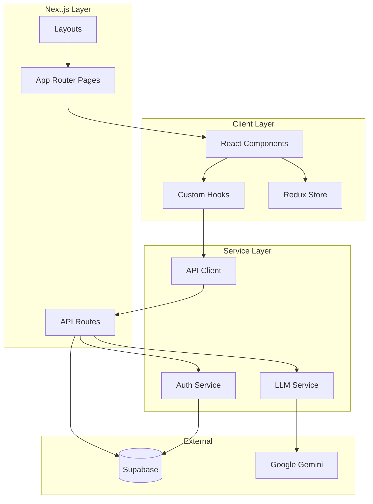
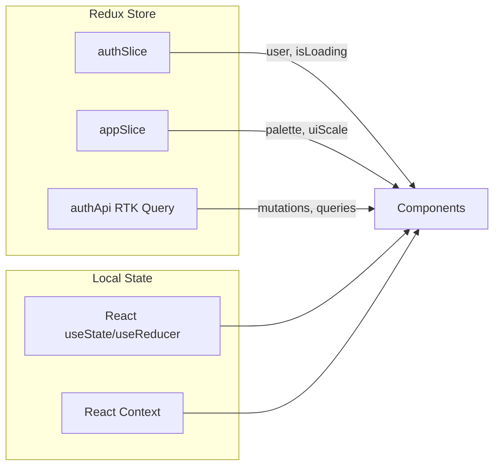
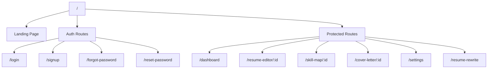
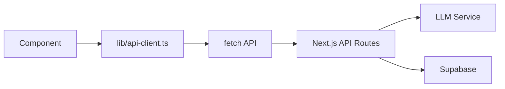
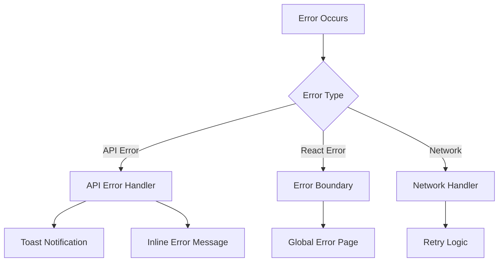
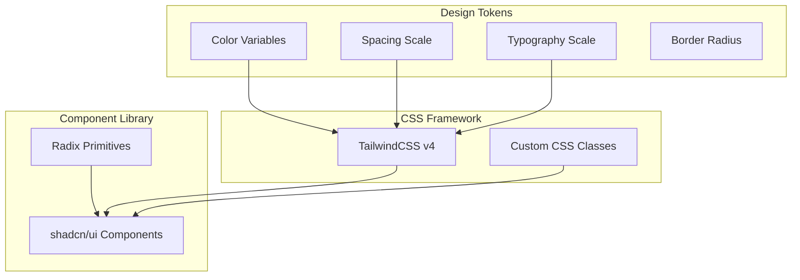
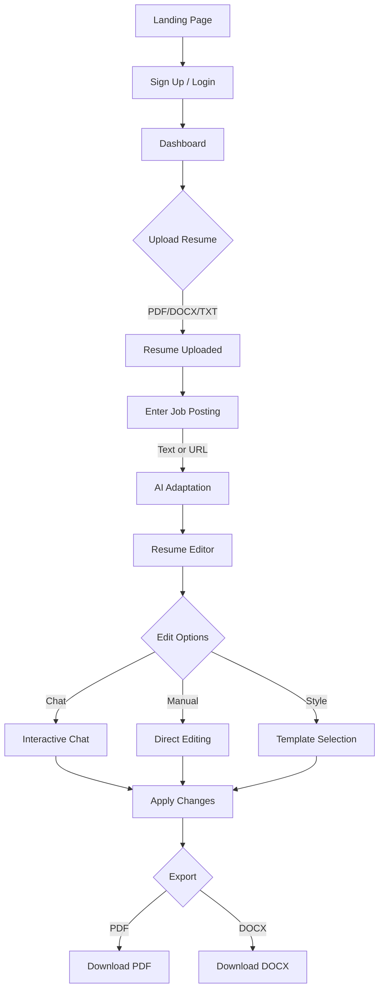
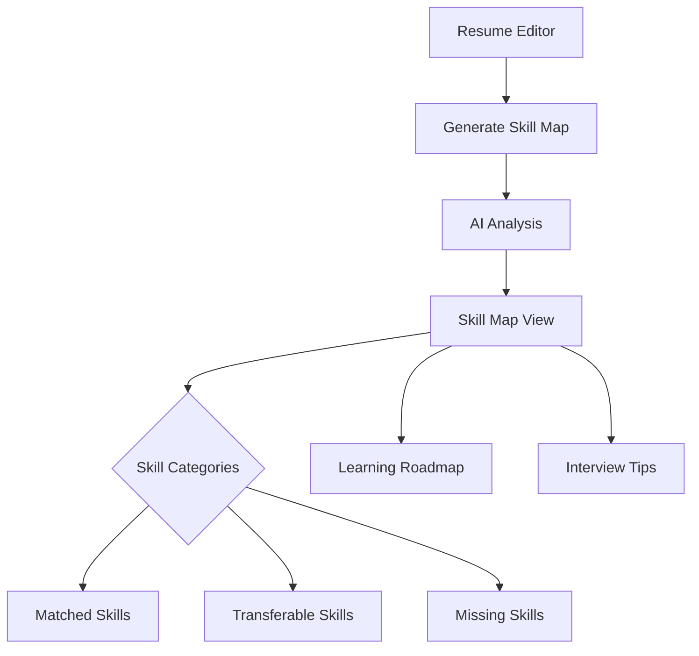
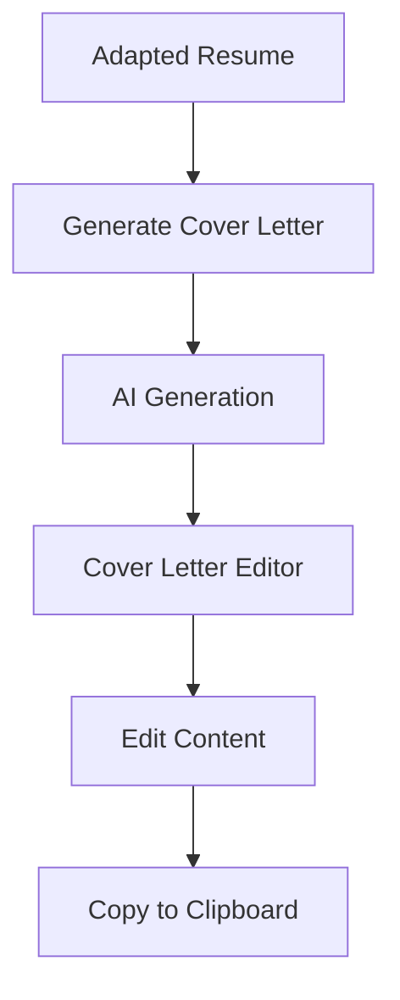

# CVify Frontend Architecture & Development Documentation

> **CVify (ImpreCV)** is an AI-powered resume optimization SPA (Single Page Application) built with modern React and Next.js. This document provides comprehensive technical documentation of the frontend architecture, components, state management, API integration, and engineering practices.

---

## Table of Contents

1. [Technology Stack & Justification](#1-technology-stack--justification)
2. [Architectural Overview](#2-architectural-overview)
3. [Project Structure](#3-project-structure)
4. [Component Architecture](#4-component-architecture)
5. [State Management](#5-state-management)
6. [Routing & Navigation](#6-routing--navigation)
7. [API Integration](#7-api-integration)
8. [Forms & Validation](#8-forms--validation)
9. [Error Handling](#9-error-handling)
10. [UI/UX & Design System](#10-uiux--design-system)
11. [Performance Optimization](#11-performance-optimization)
12. [Testing](#12-testing)
13. [Code Quality & Tooling](#13-code-quality--tooling)
14. [Accessibility](#14-accessibility)
15. [User Flows](#15-user-flows)
16. [Appendix: Data Types](#appendix-data-types)

---

## 1. Technology Stack & Justification

### Core Technologies

| Technology | Version | Purpose | Justification |
|------------|---------|---------|---------------|
| **Next.js** | 16.x | Framework | App Router with RSC, file-based routing, API routes, built-in optimization |
| **React** | 19.x | UI Library | Latest concurrent features, improved performance, hooks ecosystem |
| **TypeScript** | 5.x | Type Safety | Compile-time type checking, improved DX, better refactoring |
| **Redux Toolkit** | 2.9.x | Global State | Predictable state container with RTK Query for data fetching |
| **TailwindCSS** | 4.x | Styling | Utility-first CSS, rapid development, consistent design system |

### UI Component Library

| Library | Purpose |
|---------|---------|
| **shadcn/ui** | Pre-built accessible components based on Radix UI primitives |
| **Radix UI** | Unstyled, accessible component primitives (Dialog, Dropdown, Tabs, etc.) |
| **Lucide React** | Comprehensive icon library with consistent styling |
| **Framer Motion** | Production-ready animations and gestures |

### Additional Libraries

| Library | Purpose |
|---------|---------|
| **Zod** | Runtime schema validation for forms and API responses |
| **React Hook Form** | Performant form handling with validation |
| **Sonner** | Toast notifications with queuing |
| **Recharts** | Data visualization (skill map charts) |
| **date-fns** | Date formatting and manipulation |
| **next-themes** | Theme management with SSR support |

### Why This Stack?

1. **Next.js 16 + React 19**: Leverages React Server Components for initial page loads while maintaining client-side interactivity. The App Router provides intuitive file-based routing with layouts.

2. **Redux Toolkit with RTK Query**: Provides a single source of truth for application state. RTK Query handles caching, deduplication, and automatic refetching for API data.

3. **TypeScript**: Ensures type safety across the entire codebase, catching errors at compile time and enabling better IDE support.

4. **TailwindCSS v4**: Enables rapid UI development with utility classes while maintaining consistency through CSS custom properties.

5. **shadcn/ui + Radix**: Provides accessible, customizable components that integrate seamlessly with Tailwind styling.

---

## 2. Architectural Overview

### High-Level Architecture



### Architectural Approach

The application follows a **Feature-Sliced Design** combined with **Component-Driven Development**:

1. **Separation of Concerns**:
   - **Components**: Reusable UI elements (`components/ui/`)
   - **Pages/Containers**: Route-specific logic (`app/`)
   - **Features**: Business logic modules (`features/`)
   - **Hooks**: Reusable stateful logic (`hooks/`)
   - **Services/Lib**: Utilities and API clients (`lib/`)

2. **Unidirectional Data Flow**:
   - User actions trigger dispatches to Redux or API calls
   - State updates flow down through component props
   - Side effects handled in hooks or RTK Query

3. **Server/Client Boundary**:
   - Server Components for initial data fetching
   - Client Components for interactivity
   - API Routes for backend logic

---

## 3. Project Structure

```
cvify-app/
├── app/                          # Next.js App Router
│   ├── api/                      # API Routes
│   │   ├── adapt-resume/         # Resume adaptation endpoint
│   │   ├── chat-resume/          # Interactive chat endpoint
│   │   ├── export-resume/        # PDF export endpoint
│   │   ├── generate-cover-letter/# Cover letter generation
│   │   ├── generate-skill-map/   # Skill gap analysis
│   │   ├── resumes/              # Resume CRUD operations
│   │   └── ...                   # Additional endpoints
│   ├── dashboard/                # Main dashboard page
│   ├── resume-editor/            # Resume editing interface
│   ├── skill-map/                # Skill analysis page
│   ├── cover-letter/             # Cover letter page
│   ├── login/                    # Authentication pages
│   ├── signup/
│   ├── settings/                 # User settings
│   ├── layout.tsx                # Root layout with providers
│   ├── page.tsx                  # Landing page
│   └── global-error.tsx          # Global error boundary
│
├── components/                   # React Components
│   ├── ui/                       # Base UI components (59 components)
│   │   ├── button.tsx
│   │   ├── card.tsx
│   │   ├── dialog.tsx
│   │   ├── form.tsx
│   │   ├── input.tsx
│   │   └── ...
│   ├── dashboard/                # Dashboard-specific components
│   ├── resume-editor/            # Editor components
│   ├── resume-templates/         # Resume rendering
│   ├── chat/                     # Chat interface
│   ├── skill-map/                # Skill visualization
│   ├── providers.tsx             # Context providers
│   ├── theme-provider.tsx        # Theme context
│   └── global-header.tsx         # Navigation header
│
├── features/                     # Redux feature slices
│   ├── auth/                     # Authentication slice
│   │   └── authSlice.ts
│   ├── app/                      # App-wide state
│   │   └── appSlice.ts
│   └── api/                      # RTK Query API
│       └── authApi.ts
│
├── hooks/                        # Custom React hooks
│   ├── use-match-journey.ts      # Scroll-based animations
│   ├── use-mobile.ts             # Responsive detection
│   ├── use-page-loading.ts       # Loading states
│   └── use-toast.ts              # Toast notifications
│
├── lib/                          # Utilities and services
│   ├── api/                      # LLM and logging utilities
│   │   ├── llm.ts                # Centralized LLM client
│   │   └── logger.ts             # Structured logging
│   ├── redux/                    # Redux store configuration
│   │   ├── store.ts
│   │   └── hooks.ts
│   ├── supabase/                 # Supabase client
│   ├── resume-templates/         # Template definitions
│   ├── api-client.ts             # Frontend API wrapper
│   ├── constants.ts              # Application constants
│   └── text-utils.ts             # Text processing
│
├── types/                        # TypeScript definitions
│   ├── skill-map.ts
│   └── job-posting.ts
│
├── styles/                       # Global styles
│   └── globals.css               # TailwindCSS + custom styles
│
└── public/                       # Static assets
```

---

## 4. Component Architecture

### Component Categories

#### 1. Base UI Components (`components/ui/`)

59 reusable, styled components built on Radix UI primitives:

| Category | Components |
|----------|------------|
| **Inputs** | Button, Input, Textarea, Select, Checkbox, Switch, Slider, Radio |
| **Layout** | Card, Separator, Aspect Ratio, Resizable Panels |
| **Feedback** | Toast, Alert, Progress, Skeleton, Spinner |
| **Overlay** | Dialog, Drawer, Sheet, Popover, Tooltip, Hover Card |
| **Navigation** | Tabs, Accordion, Collapsible, Navigation Menu, Breadcrumb |
| **Data Display** | Table, Badge, Avatar, Chart |
| **Form** | Form, Field, Label, Input Group |

**Example: Button Component**

```typescript
// components/ui/button.tsx
import { cva, type VariantProps } from "class-variance-authority"

const buttonVariants = cva(
  "inline-flex items-center justify-center rounded-md text-sm font-medium transition-colors",
  {
    variants: {
      variant: {
        default: "bg-primary text-primary-foreground hover:bg-primary/90",
        destructive: "bg-destructive text-destructive-foreground hover:bg-destructive/90",
        outline: "border border-input bg-background hover:bg-accent",
        secondary: "bg-secondary text-secondary-foreground hover:bg-secondary/80",
        ghost: "hover:bg-accent hover:text-accent-foreground",
        link: "text-primary underline-offset-4 hover:underline",
      },
      size: {
        default: "h-10 px-4 py-2",
        sm: "h-9 rounded-md px-3",
        lg: "h-11 rounded-md px-8",
        icon: "h-10 w-10",
      },
    },
    defaultVariants: {
      variant: "default",
      size: "default",
    },
  }
)
```

#### 2. Feature Components

Domain-specific components organized by feature:

| Feature | Key Components |
|---------|----------------|
| **Dashboard** | `DashboardClient`, `ResumeUploader`, `JobPostingInput` |
| **Resume Editor** | `DesktopResumeEditor`, `MobileResumeEditor`, `StylePicker` |
| **Chat** | `ChatPanel`, `ChatMessage`, `ChatInput` |
| **Skill Map** | `SkillMapVisualization`, `SkillCategory`, `LearningRoadmap` |
| **Cover Letter** | `CoverLetterEditor`, `CoverLetterPreview` |

#### 3. Layout Components

```typescript
// components/providers.tsx - Root provider composition
export function Providers({ children }: { children: React.ReactNode }) {
  return (
    <ThemeProvider attribute="class" defaultTheme="system" enableSystem>
      <Provider store={store}>
        <AuthSync />          {/* Syncs auth state on mount */}
        <PaletteSync />       {/* Syncs color palette preferences */}
        <UiScaleSync />       {/* Syncs UI scale preferences */}
        {children}
        <Toaster />           {/* Toast notification container */}
      </Provider>
    </ThemeProvider>
  )
}
```

### Custom Hooks

#### `useResumeEditor` - Complex Editor State Management

The `useResumeEditor` hook (762 lines) encapsulates all resume editor logic:

```typescript
interface UseResumeEditorReturn {
  // Resume data
  resumeData: ResumeData
  variant: ResumeVariantId
  theme: "light" | "dark"
  
  // Actions
  updatePersonalInfo: (field: string, value: string) => void
  updateSection: (index: number, updates: Partial<ResumeSection>) => void
  addSection: (section: ResumeSection) => void
  deleteSection: (index: number) => void
  reorderSections: (startIndex: number, endIndex: number) => void
  
  // Chat integration
  applyModifications: (mods: ResumeModification[]) => void
  
  // Export
  exportToPdf: () => Promise<void>
  exportToDocx: () => Promise<void>
  
  // State
  hasUnsavedChanges: boolean
  isSaving: boolean
  isExporting: boolean
}
```

#### `useMatchJourney` - Scroll-Based Animations

Manages scroll progress and active step detection for the landing page:

```typescript
export function useMatchJourney({ stepsCount }: UseMatchJourneyParams) {
  const [progress, setProgress] = useState(0)
  const [activeIndex, setActiveIndex] = useState(0)
  const [timelineFill, setTimelineFill] = useState(0)

  // Uses RAF for smooth 60fps scroll tracking
  useEffect(() => {
    const handleScroll = () => {
      requestAnimationFrame(() => {
        // Calculate progress based on element positions
        // Update active step based on focal point intersection
      })
    }
    window.addEventListener("scroll", handleScroll, { passive: true })
    return () => window.removeEventListener("scroll", handleScroll)
  }, [])

  return { progress, activeIndex, timelineFill, /* refs */ }
}
```

---

## 5. State Management

### Architecture Overview



### Global State (Redux Toolkit)

#### Store Configuration

```typescript
// lib/redux/store.ts
import { configureStore } from "@reduxjs/toolkit"
import authReducer from "@/features/auth/authSlice"
import appReducer from "@/features/app/appSlice"
import { authApi } from "@/features/api/authApi"

export const store = configureStore({
  reducer: {
    auth: authReducer,
    app: appReducer,
    [authApi.reducerPath]: authApi.reducer,
  },
  middleware: (getDefault) => getDefault().concat(authApi.middleware),
  devTools: process.env.NODE_ENV !== "production",
})

export type RootState = ReturnType<typeof store.getState>
export type AppDispatch = typeof store.dispatch
```

#### Auth Slice - User Authentication State

```typescript
// features/auth/authSlice.ts
interface AuthState {
  user: AuthUser | null
  isLoading: boolean
  error?: string | null
}

// Async thunks for auth operations
export const initializeAuth = createAsyncThunk("auth/initialize", async () => {
  const supabase = getSupabaseBrowserClient()
  const { data: { user } } = await supabase.auth.getUser()
  return { user }
})

export const signOutThunk = createAsyncThunk("auth/signOut", async () => {
  const supabase = getSupabaseBrowserClient()
  await supabase.auth.signOut()
})
```

#### App Slice - Application Preferences

```typescript
// features/app/appSlice.ts
interface AppState {
  paletteLight: PaletteName    // Color theme for light mode
  paletteDark: PaletteName     // Color theme for dark mode
  uiScale: "small" | "medium" | "large"
  isInitialLoading: boolean
}

// Actions for preference management
export const { 
  setPaletteForTheme, 
  hydratePalettes, 
  setUiScale 
} = appSlice.actions
```

#### RTK Query - API Mutations

```typescript
// features/api/authApi.ts
export const authApi = createApi({
  reducerPath: "authApi",
  baseQuery: fakeBaseQuery(),
  endpoints: (builder) => ({
    getUser: builder.query<{ user: AuthUser | null }, void>({...}),
    signIn: builder.mutation<{ ok: boolean; message?: string }, { email: string; password: string }>({...}),
    signUp: builder.mutation<{ ok: boolean; message?: string }, SignUpPayload>({...}),
    signOut: builder.mutation<{ ok: boolean; message?: string }, void>({...}),
    updateProfile: builder.mutation<{ ok: boolean; message?: string }, ProfilePayload>({...}),
    deleteAccount: builder.mutation<{ ok: boolean; message?: string }, void>({...}),
  }),
})

// Auto-generated hooks
export const { 
  useGetUserQuery, 
  useSignInMutation, 
  useSignUpMutation,
  useSignOutMutation,
  useUpdateProfileMutation,
  useDeleteAccountMutation 
} = authApi
```

### Local Component State

Used for UI-specific state that doesn't need persistence:

| State Type | Use Case | Example |
|------------|----------|---------|
| `useState` | Form inputs, toggles | `const [email, setEmail] = useState("")` |
| `useReducer` | Complex form state | Resume editor modifications |
| React Context | Theme, feature flags | `ThemeProvider`, `CoverLetterContext` |

---

## 6. Routing & Navigation

### Route Structure



### Route Definitions

| Route | Type | Description |
|-------|------|-------------|
| `/` | Public | Landing page with product information |
| `/login` | Public | User authentication |
| `/signup` | Public | User registration |
| `/forgot-password` | Public | Password reset request |
| `/reset-password` | Public | Password reset form |
| `/dashboard` | Protected | Main user dashboard |
| `/resume-editor/[id]` | Protected | Resume editing interface |
| `/skill-map/[id]` | Protected | Skill gap analysis visualization |
| `/cover-letter/[id]` | Protected | Cover letter editor |
| `/settings` | Protected | User preferences |

### Dynamic Routes

```typescript
// app/resume-editor/[id]/page.tsx
export default async function ResumeEditorPage({ 
  params 
}: { 
  params: Promise<{ id: string }> 
}) {
  const { id } = await params
  const supabase = await getSupabaseServerClient()
  
  // Fetch resume data server-side
  const { data: resume } = await supabase
    .from("rewritten_resumes")
    .select("*")
    .eq("id", id)
    .single()
    
  return <ResumeEditorClient initialData={resume.structured_data} resumeId={id} />
}
```

### Navigation Patterns

1. **Programmatic Navigation**: Using `useRouter` from Next.js
2. **Link Component**: For declarative navigation
3. **Redirect**: Server-side redirects for protected routes

```typescript
// Protected route pattern
const router = useRouter()
const { user, isLoading } = useAppSelector(state => state.auth)

useEffect(() => {
  if (!isLoading && !user) {
    router.push("/login?redirect=/dashboard")
  }
}, [user, isLoading])
```

---

## 7. API Integration

### API Client Architecture



### Centralized API Client

```typescript
// lib/api-client.ts
export async function analyzeResume(payload: AnalyzeResumePayload): Promise<AnalyzeResumeResult> {
  const response = await fetch("/api/adapt-resume", {
    method: "POST",
    headers: { "Content-Type": "application/json" },
    body: JSON.stringify(payload),
  })
  
  const data = await response.json().catch(() => ({}))
  
  if (!response.ok) {
    const message = typeof data.error === "string" 
      ? data.error 
      : `Analysis failed with status ${response.status}`
    throw new Error(message)
  }
  
  return {
    id: data.item.id,
    data: data.resumeData,
    variant: data.item.variant || defaultResumeVariant,
    theme: data.item.theme || "light",
  }
}

export async function generateCoverLetter(payload: GenerateCoverLetterPayload): Promise<GenerateCoverLetterResult>
export async function generateSkillMap(payload: GenerateSkillMapPayload): Promise<GenerateSkillMapResult>
export async function getSkillMap(id: string): Promise<SkillMapRecord>
export async function deleteSkillMap(id: string): Promise<void>
```

### API Endpoints Reference

| Endpoint | Method | Description |
|----------|--------|-------------|
| `/api/adapt-resume` | POST | Adapt resume to job posting via AI |
| `/api/chat-resume` | POST | Interactive resume editing chat |
| `/api/export-resume` | POST | Generate PDF export |
| `/api/generate-cover-letter` | POST | AI cover letter generation |
| `/api/generate-skill-map` | POST | Skill gap analysis |
| `/api/resumes/upload` | POST | Upload resume file (PDF/DOCX/TXT) |
| `/api/resumes/[id]` | DELETE | Delete uploaded resume |
| `/api/rewritten-resumes` | GET | List adapted resumes |
| `/api/cover-letter` | GET | List cover letters |
| `/api/skill-map/[id]` | GET/DELETE | Skill map operations |
| `/api/account/delete` | POST | Delete user account |
| `/api/health` | GET | Health check endpoint |

### Request/Response Types

```typescript
// Resume Adaptation
interface AdaptResumeRequest {
  resumeText?: string     // Raw resume text
  resumeId?: string       // Or reference to uploaded resume
  jobDescription?: string // Job posting text
  jobLink?: string        // Or URL to fetch
}

interface AdaptResumeResponse {
  item: {
    id: string
    structured_data: ResumeData
    job_title: string
    job_company: string
  }
  resumeData: ResumeData
  updated: boolean
}

// Chat Interaction
interface ChatRequest {
  message: string                 // User message (max 500 chars)
  resumeData: ResumeData          // Current resume state
  rewrittenResumeId?: string      // Reference to adapted resume
  history?: ChatMessage[]         // Conversation history (max 6)
}

interface ChatResponse {
  message: string                 // Assistant response
  modifications?: ResumeModification[]  // Changes to apply
  action?: "reset"                // Special actions
  usage: {
    count: number                 // Current usage
    maxCount: number              // Limit (50/day)
    resetAt: number               // Reset timestamp
  }
}
```

---

## 8. Forms & Validation

### Form Libraries

| Library | Purpose |
|---------|---------|
| **React Hook Form** | Form state management, performance optimization |
| **Zod** | Schema validation with TypeScript inference |
| **@hookform/resolvers** | Integration between RHF and Zod |

### Validation Patterns

#### Client-Side Validation

```typescript
// Login form validation
const handleLogin = async (e: React.FormEvent) => {
  e.preventDefault()
  
  // Email format validation
  const emailRegex = /^[^\s@]+@[^\s@]+\.[^\s@]+$/
  if (!emailRegex.test(email)) {
    setError("Please enter a valid email address")
    return
  }
  
  // Empty field validation
  if (!email || !password) {
    setError("Please fill in all fields")
    return
  }
  
  // Proceed with API call
}
```

#### Text Content Validation

```typescript
// lib/text-utils.ts
export function isMeaningfulText(rawText: string): boolean {
  const text = rawText?.trim() ?? ""
  if (text.length < 90) return false
  
  const words = text.split(/\s+/).filter(Boolean)
  if (words.length < 10) return false
  
  const letters = text.replace(/[^a-zA-Z]/g, "").length
  if (letters / text.length < 0.5) return false
  
  return true
}

export function sanitizePlainText(text: string): string {
  let cleaned = text
  // Remove markdown code blocks
  cleaned = cleaned.replace(/```[\s\S]*?```/g, "")
  // Remove inline code
  cleaned = cleaned.replace(/`+/g, "")
  // Normalize whitespace
  cleaned = cleaned.replace(/\s+/g, " ").trim()
  return cleaned
}
```

### Form Components

```typescript
// Reactive form with controlled inputs
function LoginForm() {
  const [email, setEmail] = useState("")
  const [password, setPassword] = useState("")
  const [error, setError] = useState<string | null>(null)
  const [signIn] = useSignInMutation()

  return (
    <form onSubmit={handleLogin}>
      <div className="space-y-2">
        <Label htmlFor="email">Email</Label>
        <Input
          id="email"
          type="email"
          value={email}
          onChange={(e) => setEmail(e.target.value)}
          required
        />
      </div>
      
      {error && (
        <div className="p-3 rounded-lg bg-destructive/10 border border-destructive/20 text-destructive">
          {error}
        </div>
      )}
      
      <Button type="submit" disabled={loading}>
        {loading ? <Loader2 className="animate-spin" /> : "Log In"}
      </Button>
    </form>
  )
}
```

---

## 9. Error Handling

### Error Handling Strategy



### Global Error Boundary

```typescript
// app/global-error.tsx
'use client'

export default function GlobalError({
  error,
  reset,
}: {
  error: Error & { digest?: string }
  reset: () => void
}) {
  useEffect(() => {
    console.error('Global error:', error)
  }, [error])

  return (
    <html lang="en" className="dark">
      <body>
        <Card className="glass-card max-w-md w-full p-8 text-center">
          <AlertTriangle className="h-8 w-8 text-destructive" />
          <h1>Something went wrong</h1>
          <p>An unexpected error occurred. Please try again.</p>
          
          {error.digest && (
            <p className="font-mono">Error ID: {error.digest}</p>
          )}
          
          <Button onClick={reset}>Try Again</Button>
          <Button variant="outline" asChild>
            <Link href="/">Return Home</Link>
          </Button>
        </Card>
      </body>
    </html>
  )
}
```

### API Error Handling

```typescript
// Centralized error handling in API client
export async function analyzeResume(payload: AnalyzeResumePayload) {
  try {
    const response = await fetch("/api/adapt-resume", {
      method: "POST",
      headers: { "Content-Type": "application/json" },
      body: JSON.stringify(payload),
    })
    
    const data = await response.json().catch(() => ({}))
    
    if (!response.ok) {
      const message = typeof data.error === "string" 
        ? data.error 
        : `Analysis failed with status ${response.status}`
      throw new Error(message)
    }
    
    return data
  } catch (error) {
    throw error // Re-throw for component handling
  }
}
```

### HTTP Status Code Handling

| Status | Handling |
|--------|----------|
| **401** | Redirect to login page |
| **403** | Show "Access Denied" message |
| **404** | Show "Not Found" with navigation options |
| **429** | Show rate limit message with cooldown timer |
| **500** | Show generic error with retry option |

### Toast Notifications

```typescript
// Using Sonner for toast notifications
import { toast } from "sonner"

// Success notification
toast.success("Resume saved successfully")

// Error notification with action
toast.error("Failed to export PDF", {
  action: {
    label: "Retry",
    onClick: () => handleExport()
  }
})

// Loading state
const toastId = toast.loading("Generating cover letter...")
toast.dismiss(toastId)
```

### Loading States & Skeletons

```typescript
// Skeleton loading state for async data
function DashboardSkeleton() {
  return (
    <div className="space-y-4">
      <Skeleton className="h-8 w-48" />
      <Skeleton className="h-32 w-full" />
      <Skeleton className="h-32 w-full" />
    </div>
  )
}

// Usage with Suspense
<Suspense fallback={<DashboardSkeleton />}>
  <DashboardContent />
</Suspense>
```

---

## 10. UI/UX & Design System

### Design System Architecture



### Color System with Theming

```css
/* styles/globals.css */
:root {
  --background: oklch(1 0 0);
  --foreground: oklch(0.145 0 0);
  --primary: oklch(0.205 0 0);
  --primary-foreground: oklch(0.985 0 0);
  --muted: oklch(0.97 0 0);
  --muted-foreground: oklch(0.4 0 0);
  --accent: oklch(0.97 0 0);
  --destructive: oklch(0.577 0.245 27.325);
  --border: oklch(0.922 0 0);
  --ring: oklch(0.708 0 0);
  
  /* Gradient colors for branding */
  --gradient-1: #d4d4d4;
  --gradient-2: #a3a3a3;
  --gradient-3: #737373;
}

.dark {
  --background: oklch(0.145 0 0);
  --foreground: oklch(0.985 0 0);
  --primary: oklch(0.985 0 0);
  --primary-foreground: oklch(0.205 0 0);
  --muted: oklch(0.269 0 0);
  --muted-foreground: oklch(0.78 0 0);
  --destructive: oklch(0.7 0.2 25.7);
  --border: oklch(0.269 0 0);
}
```

### Glassmorphism Effects

```css
/* Custom glassmorphism styles */
.glass-card {
  background: oklch(from var(--card) l c h / 0.3);
  backdrop-filter: blur(16px) saturate(180%);
  box-shadow: 0 4px 6px -1px rgba(0, 0, 0, 0.1);
  border: 1px solid oklch(from var(--border) l c h / 0.6);
  animation: glass-pulse 3s ease-in-out infinite;
}

.dark .glass-card {
  background: rgba(255, 255, 255, 0.06);
  box-shadow: 0 4px 6px -1px rgba(0, 0, 0, 0.2);
}

/* Chat panel styling */
.glass-chat-panel {
  background: oklch(from var(--card) l c h / 0.85);
  backdrop-filter: blur(24px) saturate(180%);
  box-shadow: 0 25px 50px -12px rgba(0, 0, 0, 0.25);
}
```

### Animation System

```css
/* Entrance animations */
[data-animate] {
  opacity: 0;
  transform: translate3d(var(--x, 0), var(--y, 0), 0) scale(var(--scale, 1));
  transition-property: opacity, transform;
  transition-duration: var(--anim-duration, 700ms);
  transition-timing-function: cubic-bezier(0.22, 1, 0.36, 1);
}

[data-animate][data-inview="true"] {
  opacity: 1;
  transform: none;
}

/* Bubble entrance animation */
@keyframes bubble-in {
  0% { opacity: 0; transform: translateY(8px) scale(0.96); }
  60% { opacity: 1; transform: translateY(0) scale(1.01); }
  100% { opacity: 1; transform: translateY(0) scale(1); }
}

/* Respect user motion preferences */
@media (prefers-reduced-motion: reduce) {
  [data-animate] {
    transition: none !important;
    animation: none !important;
    transform: none !important;
    opacity: 1 !important;
  }
}
```

### Responsive Design

```typescript
// hooks/use-mobile.ts
export function useMobile() {
  const [isMobile, setIsMobile] = useState(false)
  
  useEffect(() => {
    const checkMobile = () => setIsMobile(window.innerWidth < 768)
    checkMobile()
    window.addEventListener("resize", checkMobile)
    return () => window.removeEventListener("resize", checkMobile)
  }, [])
  
  return isMobile
}

// Component usage
function ResumeEditor() {
  const isMobile = useMobile()
  
  return isMobile 
    ? <MobileResumeEditor {...props} />
    : <DesktopResumeEditor {...props} />
}
```

### UI Scale System

```typescript
// features/app/appSlice.ts
export type UiScale = "small" | "medium" | "large"

// Scale values applied via CSS custom property
const scaleValues = {
  small: 0.875,   // 14px base
  medium: 1,      // 16px base
  large: 1.125,   // 18px base
}

// Applied in globals.css
html {
  font-size: calc(16px * var(--ui-scale, 1));
}
```

---

## 11. Performance Optimization

### Code Splitting & Lazy Loading

```typescript
// Dynamic imports for route-based code splitting
const ResumeEditor = dynamic(
  () => import("@/components/resume-editor"),
  { loading: () => <ResumeEditorSkeleton /> }
)

// React.lazy for component-level splitting
const ChartComponent = lazy(() => import("recharts"))
```

### Image Optimization

```typescript
// Using Next.js Image component
import Image from "next/image"

<Image
  src="/logo.png"
  alt="CVify Logo"
  width={120}
  height={40}
  priority // For above-the-fold images
/>
```

### Memoization

```typescript
// Component memoization
const MemoizedSkillCard = memo(function SkillCard({ skill }: SkillCardProps) {
  return <Card>{/* ... */}</Card>
})

// useMemo for expensive computations
const filteredSkills = useMemo(
  () => skills.filter(s => s.category === activeCategory),
  [skills, activeCategory]
)

// useCallback for stable function references
const handleSkillClick = useCallback((id: string) => {
  setSelectedSkill(id)
}, [])
```

### Request Optimization

```typescript
// RTK Query handles caching and deduplication automatically
export const authApi = createApi({
  // Cached queries prevent duplicate requests
  endpoints: (builder) => ({
    getUser: builder.query({ /* ... */ }),
  }),
})

// Request deduplication key for preventing duplicate submissions
const [requestKey, setRequestKey] = useState<string | null>(null)

const buildRequestKey = (opts) => {
  return `${opts.resumeId || opts.resumeText?.slice(0, 50)}_${opts.jobText?.slice(0, 50)}`
}
```

### Animation Performance

```typescript
// Using RAF for scroll-based animations
const handleScroll = () => {
  cancelAnimationFrame(rafId)
  rafId = requestAnimationFrame(() => {
    // Calculate scroll positions
    // Update state minimally
  })
}

window.addEventListener("scroll", handleScroll, { passive: true })
```

---

## 12. Testing

### Testing Stack

| Tool | Purpose |
|------|---------|
| **Vitest** | Test runner with Jest-compatible API |
| **Testing Library** | React component testing utilities |
| **jsdom** | Browser environment simulation |
| **v8** | Code coverage provider |

### Test Configuration

```typescript
// vitest.config.ts
export default defineConfig({
  plugins: [react()],
  test: {
    environment: 'jsdom',
    globals: true,
    include: ['**/*.test.{ts,tsx}'],
    exclude: ['node_modules', '.next'],
    coverage: {
      provider: 'v8',
      reporter: ['text', 'text-summary'],
      include: ['lib/**/*.ts'],
      exclude: ['**/*.test.ts', '**/*.d.ts'],
    },
  },
  resolve: {
    alias: {
      '@': path.resolve(__dirname, './'),
    },
  },
})
```

### Unit Tests

#### Text Utilities Tests

```typescript
// lib/text-utils.test.ts
import { describe, it, expect } from 'vitest'
import { isMeaningfulText, sanitizePlainText } from './text-utils'

describe('isMeaningfulText', () => {
  it('returns false for short text', () => {
    expect(isMeaningfulText('Too short')).toBe(false)
  })
  
  it('returns true for valid resume content', () => {
    const validText = 'Software Engineer with 5 years of experience...'
    expect(isMeaningfulText(validText)).toBe(true)
  })
})

describe('sanitizePlainText', () => {
  it('removes markdown code blocks', () => {
    const input = '```code```text'
    expect(sanitizePlainText(input)).toBe('text')
  })
})
```

#### Math Utilities Tests

```typescript
// lib/math.test.ts
import { describe, it, expect } from 'vitest'
import { clamp } from './math'

describe('clamp', () => {
  it('returns min when value is below range', () => {
    expect(clamp(-5, 0, 100)).toBe(0)
  })
  
  it('returns max when value is above range', () => {
    expect(clamp(150, 0, 100)).toBe(100)
  })
  
  it('returns value when within range', () => {
    expect(clamp(50, 0, 100)).toBe(50)
  })
})
```

#### Job Posting Parser Tests

```typescript
// lib/job-posting.test.ts
import { describe, it, expect } from 'vitest'
import { normalizeJobLink, extractJobInfo } from './job-posting'

describe('normalizeJobLink', () => {
  it('normalizes LinkedIn URLs', () => {
    const input = 'https://www.linkedin.com/jobs/view/123'
    expect(normalizeJobLink(input)).toContain('linkedin.com')
  })
})
```

### Running Tests

```bash
# Run all tests
pnpm test

# Run tests in watch mode
pnpm test:watch

# Generate coverage report
pnpm test:coverage
```

---

## 13. Code Quality & Tooling

### ESLint Configuration

```javascript
// eslint.config.mjs
import { FlatCompat } from "@eslint/eslintrc"

const eslintConfig = [
  ...compat.extends("next/core-web-vitals", "next/typescript"),
  {
    ignores: [
      "**/node_modules/**",
      "**/.next/**",
      "**/out/**",
      "**/dist/**",
      "**/build/**",
    ],
  },
]

export default eslintConfig
```

### TypeScript Configuration

```json
// tsconfig.json
{
  "compilerOptions": {
    "target": "ES2017",
    "lib": ["dom", "dom.iterable", "esnext"],
    "strict": true,
    "noEmit": true,
    "module": "esnext",
    "moduleResolution": "bundler",
    "resolveJsonModule": true,
    "isolatedModules": true,
    "jsx": "preserve",
    "incremental": true,
    "paths": {
      "@/*": ["./*"]
    }
  }
}
```

### Build Tooling

| Tool | Purpose |
|------|---------|
| **Next.js** | Build and bundling |
| **PostCSS** | CSS processing |
| **TailwindCSS** | Utility class generation |
| **TypeScript** | Type checking |

### Scripts

```json
// package.json
{
  "scripts": {
    "dev": "next dev",
    "build": "next build",
    "start": "next start",
    "lint": "eslint .",
    "test": "vitest run",
    "test:watch": "vitest",
    "test:coverage": "vitest run --coverage"
  }
}
```

### Structured Logging

```typescript
// lib/api/logger.ts
export class Logger {
  constructor(private service: string) {}
  
  requestStart(endpoint: string, metadata?: Record<string, unknown>) {
    console.log(JSON.stringify({
      timestamp: new Date().toISOString(),
      level: "info",
      service: this.service,
      event: "request_start",
      endpoint,
      ...metadata,
    }))
  }
  
  error(event: string, error?: Error | string, metadata?: Record<string, unknown>) {
    console.error(JSON.stringify({
      timestamp: new Date().toISOString(),
      level: "error",
      service: this.service,
      event,
      error: error instanceof Error ? error.message : error,
      ...metadata,
    }))
  }
}
```

---

## 14. Accessibility

### Accessibility Features

#### Keyboard Navigation

- Full keyboard support for all interactive elements
- Focus management for modals and dialogs
- Skip links for main content

#### ARIA Implementation

```typescript
// Accessible form inputs
<Input
  id="email"
  type="email"
  aria-label="Email address"
  aria-describedby={error ? "email-error" : undefined}
  aria-invalid={!!error}
/>

{error && (
  <span id="email-error" role="alert">
    {error}
  </span>
)}
```

#### Color Contrast

- OKLCH color space for consistent contrast ratios
- Light and dark themes with appropriate contrast
- Focus indicators visible in all themes

#### Motion Preferences

```css
@media (prefers-reduced-motion: reduce) {
  [data-animate] {
    transition: none !important;
    animation: none !important;
  }
  
  .glass-card {
    animation: none;
  }
}
```

#### Screen Reader Support

- Semantic HTML structure
- Proper heading hierarchy
- Descriptive button labels
- Status announcements via `aria-live` regions

---

## 15. User Flows

### Primary User Flow: Resume Adaptation



### User Flow: Skill Gap Analysis



### User Flow: Cover Letter Generation



---

## Appendix: Data Types

### Core Resume Types

```typescript
interface PersonalInfo {
  name: string
  title?: string
  email?: string
  phone?: string
  location?: string
  linkedin?: string
  website?: string
}

interface ResumeItem {
  title: string
  subtitle?: string
  date?: string
  description?: string
  bullets?: string[]
}

type SectionType = 'header' | 'summary' | 'experience' | 'education' | 'skills' | 'custom'

interface ResumeSection {
  type: SectionType
  title?: string
  content: string | ResumeItem[]
}

interface ResumeData {
  personalInfo: PersonalInfo
  sections: ResumeSection[]
  layout?: {
    sidebarRatio?: number
  }
}
```

### Chat Modification Types

```typescript
interface ResumeModification {
  action: "update" | "add" | "delete"
  target: "personalInfo" | "section" | "item" | "bullet"
  sectionIndex?: number
  itemIndex?: number
  bulletIndex?: number
  field?: string
  value?: unknown
}

interface ChatMessage {
  role: "user" | "assistant"
  content: string
}
```

### Skill Map Types

```typescript
interface SkillMapData {
  matchScore: number           // 0-100
  adaptationScore?: number     // 0-100
  summary: string
  matchedSkills: Skill[]
  transferableSkills: Skill[]
  missingSkills: Skill[]
  learningRoadmap: RoadmapItem[]
  interviewTips: string[]
}

interface Skill {
  name: string
  priority: "high" | "medium" | "low"
  category: "matched" | "transferable" | "missing"
  resumeEvidence?: string
  jobRequirement?: string
  matchPercentage?: number
  potentialScoreIncrease?: number
}

interface RoadmapItem {
  skill: string
  importance: string
  firstStep: string
  potentialScoreIncrease: number
}
```

### API Response Types

```typescript
interface AuthUser {
  id: string
  email?: string
  user_metadata?: {
    full_name?: string
  }
}

interface AnalyzeResumeResult {
  id: string
  data: ResumeData
  variant: ResumeVariantId
  theme: "light" | "dark"
  pdfUrl?: string | null
}

interface SkillMapRecord {
  id: string
  user_id: string
  rewritten_resume_id: string
  match_score: number
  adaptation_score?: number
  data: SkillMapData
  job_title?: string
  job_company?: string
  created_at: string
}
```

---

## Conclusion

CVify demonstrates a modern, production-ready frontend architecture that prioritizes:

- **Type Safety**: Full TypeScript coverage with strict mode
- **Performance**: Code splitting, memoization, and optimized animations
- **Accessibility**: WCAG compliance with keyboard navigation and screen reader support
- **Developer Experience**: Clear project structure, comprehensive tooling, and consistent patterns
- **User Experience**: Responsive design, glassmorphism aesthetics, and smooth animations
- **Maintainability**: Feature-sliced design, centralized state management, and comprehensive testing

The architecture supports both the current feature set and future extensibility while maintaining high code quality standards.
